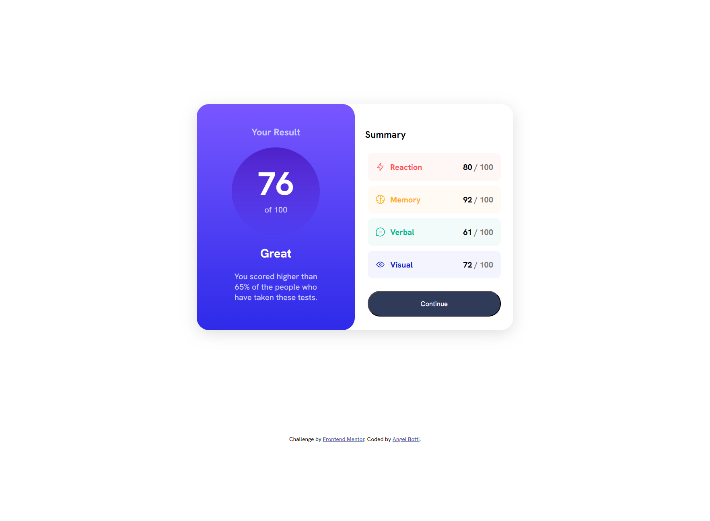
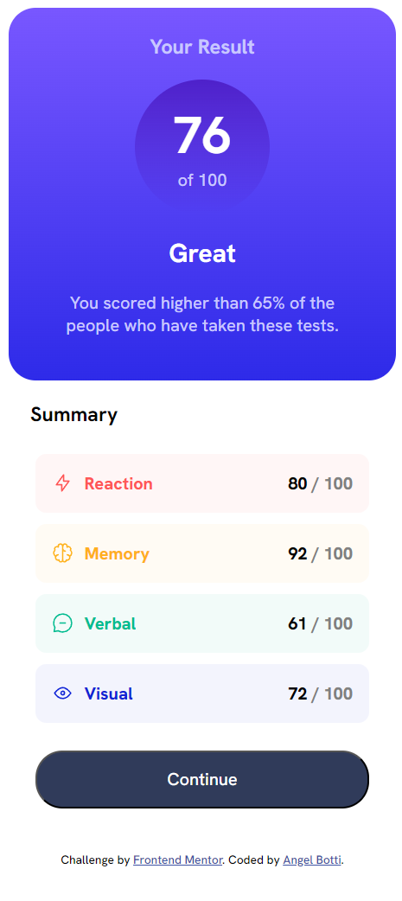
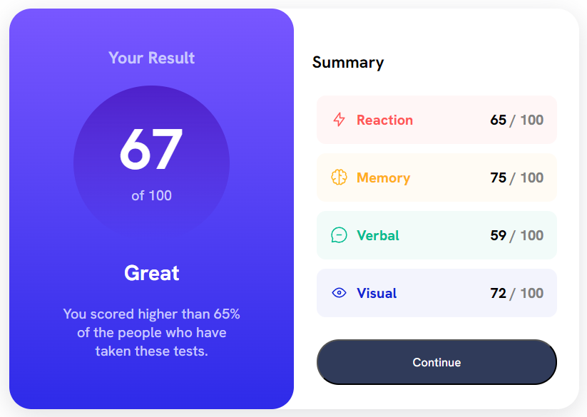

# Frontend Mentor - Results summary component solution

This is a solution to the [Results summary component challenge on Frontend Mentor](https://www.frontendmentor.io/challenges/results-summary-component-CE_K6s0maV). Frontend Mentor challenges help you improve your coding skills by building realistic projects.

## Table of contents

- [Overview](#overview)
  - [The challenge](#the-challenge)
  - [Screenshot](#screenshot)
  - [Links](#links)
- [My process](#my-process)
  - [Built with](#built-with)
  - [What I learned](#what-i-learned)
  - [Continued development](#continued-development)
  - [Useful resources](#useful-resources)
- [Author](#author)
- [Acknowledgments](#acknowledgments)

## Overview

### The challenge

Users should be able to:

- View the optimal layout for the interface depending on their device's screen size
- See hover and focus states for all interactive elements on the page

### Screenshot

Desktop view

Mobile view

Dynamic change

### Links

- Solution URL: [Add solution URL here](https://your-solution-url.com)
- Live Site URL: [Add live site URL here](https://your-live-site-url.com)

## My process

### Built with

- CSS custom properties

### What I learned

I used some CSS that I had never applied before, like box sizing, box shadow and float, as well as I kept practicing paddings and margins, which I still have some trouble with.

### Continued development

I tried to use the JSON file in a simpler way, but I couldn't figure out how without using something like React or anthing else that would just overcomplicate this, if there's such an easy way to use a JSON file please let me know! I just ended copying and pasting it in the JS file.

ALSO! I couln't for the life of me just change the text of the 
 element inside the results divs without ruining the icon and results spans! I tried and tried and searched and searched and I just eventually gave up, if anyone knows how to do this PLEASE, PLEASE LET ME KNOW!!

And of course, any feedback is appreciated!

### Useful resources

I struggled a bit with the box shadow, and while looking at its properties I found this pretty useful website!

- [CSS Box Shadow Examples](https://getcssscan.com/css-box-shadow-examples) - They have some prebuilt box shadows, I just picked the one that looked the most similar and copied the CSS code, I'm sure it can be useful in the future too!

## Author

- GitHub - [Botti13](https://github.com/Botti13)
- Frontend Mentor - [@Botti13](https://www.frontendmentor.io/profile/Botti13)
- LinkedIn - [José Angel Valdés Botti](https://www.linkedin.com/in/angelbotti/)
